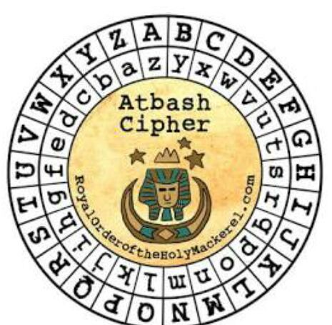

# Description
How about some hide and seek heh?
Look at this image here.

# Provided
- [atbash.jpg](.prov/351-atbash.jpg)

# Progress


## RoyalOrderoftheHolyMackerel.com
Guess i get a website.... [https://royalorderoftheholymackerel.com](https://royalorderoftheholymackerel.com) leads to [norton.com](norton.com)

This is rather useless, so what about using google instead: searching for `royal order of the holy mackerel` returns:
the [Gravity Falls Wiki](https://gravityfalls.fandom.com/wiki/The_Royal_Order_of_the_Holy_Mackerel) and a [2nd wiki](https://royalorderoftheholymackerel.fandom.com/wiki/RoyalOrderoftheHolyMackerel.com) with following entry:
```
RoyalOrderoftheHolyMackerel.com was the official website of the Royal Order of the Holy Mackerel. It contained information on the organization, puzzles and an exclusive member-only discussion forum. The website was shut down in April 2019.
```
Well looks like i'm late to the party. This is a dead end, for now at least.

## Atbash Cipher
A cipher hmm, never heared of... so let's use: [wikipedia](https://en.wikipedia.org/wiki/Atbash)

So a cipher that doesn't need a key.... but what is there to decipher?? Clearly can't use the entire image....

What about the characters on the dial?: Just the mapping of atbash....

So what now

## Forensic
As always when i do image forensic, i start at [aperisolve.com](https://www.aperisolve.com/)

Steghide seems to provide me with what i was looking for: an encrypted.txt with the content:
```
xqkwKBN{z0bib1wv_l3kzgxb3l_4k71n5j0}
```

## Back to Atbash
Now this looks like something atbash could work on... using [dcode.fr](https://www.dcode.fr/atbash-cipher) i get:
```
picoCTF{atbash_crack_92533667}
```

I don't know why this is in the cryptography category instead of the forensic one, but hey i take my flag.