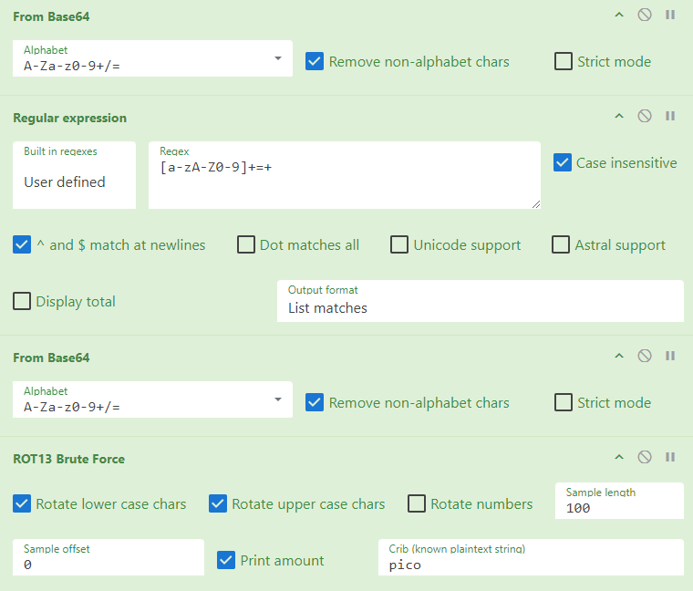

# Description
Can you get the real meaning from this file.

# Provided
- [enc_flag](.prov/418-enc_flag)
  
# Progress
The enc_flag file contains the following string:<br>
```YidkM0JxZGtwQlRYdHFhR3g2YUhsZmF6TnFlVGwzWVROclh6ZzJhMnd6TW1zeWZRPT0nCg==```

To me the end of this string looked like base64 encoding, so i fired up [Cyberchef](https://gchq.github.io/CyberChef/) and tried to decode it:<br>
```b'd3BqdkpBTXtqaGx6aHlfazNqeTl3YTNrXzg2a2wzMmsyfQ=='```

Which looks like base64 again. So i took the substring `d3BqdkpBTXtqaGx6aHlfazNqeTl3YTNrXzg2a2wzMmsyfQ==` and decoded it again:<br>
```wpjvJAM{jhlzhy_k3jy9wa3k_86kl32k2}```

Now this already looked like the flag format, but it didn't say picoCTF at the start. To me this looked like a Rotation Cypher. As i wasn't sure by what amount it was rotated, i threw the bruteforce ROT13 against it and gave it pico as known plaintext:<br>
```Amount = 19: picoCTF{caesar_d3cr9pt3d_86de32d2}```

# All in One
[CyberChef](https://gchq.github.io/CyberChef/#recipe=From_Base64('A-Za-z0-9%2B/%3D',true,false)Regular_expression('User%20defined','%5Ba-zA-Z0-9%5D%2B%3D%2B',true,true,false,false,false,false,'List%20matches')From_Base64('A-Za-z0-9%2B/%3D',true,false)ROT13_Brute_Force(true,true,false,100,0,true,'pico')&input=WWlka00wSnhaR3R3UWxSWWRIRmhSM2cyWVVoc1ptRjZUbkZsVkd3eldWUk9jbGg2WnpKaE1uZDZUVzF6ZVdaUlBUMG5DZz09&ieol=CRLF)
