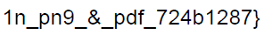

# Description
The Network Operations Center (NOC) of your local institution picked up a suspicious file they're getting conflicting information on what type of file it is. They've brought you in as an external expert to examine the file. Can you extract all the information from this strange file?

# Provided
- [flag2of2-final.pdf](.prov/423-flag2of2-final.pdf)

# Progress
I tryed to open the pdf and got an usported file error. So i instead tryed to open it in a Text editor:

The first line already shows the problem:
```‰PNG```

So i tryed to open it as a png:<br>


So here is the... wait a second this is not the entire flag....

As i couldn't remember the exact construction of a png i took the lazy approach and created a new png with gimp and opened it in a hex editor: <br>


So as i now knew again how a png ends i opened the original file in a hex editor as well looking for the IEND chunk of the png:<br>


It seems there is indeed a pdf in this file. To force my pdf reader to actually read this part of the file i deleted everything that belongs to the png and saved it as a new pdf.<br>


# Final Note
At least chromium can read the pdf without removing the png first. So just changing endings would be enough depending on the tools used.