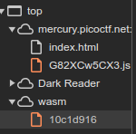

# Description
http://mercury.picoctf.net:26318/index.html

# Provided
\-

# Progress
[I made this way harder than it had to be](#im-a-moron)


Oh boy, that's not a lot to work with

```html
<head>
	<meta charset="UTF-8">
	<script src="G82XCw5CX3.js"></script>
</head>
<body wotdisconnected="true"><span id="warning-container"><i data-reactroot=""></i></span>
	<h4>Enter flag:</h4>
	<input type="text" id="input">
	<button onclick="onButtonPress()">Submit</button>
	<p id="result"></p>
</body>
```

but there should be the `G82XCw5CX3.js"` script

```javascript
const _0x402c = ['value', '2wfTpTR', 'instantiate', '275341bEPcme', 'innerHTML', '1195047NznhZg', '1qfevql', 'input', '1699808QuoWhA', 'Correct!', 'check_flag', 'Incorrect!', './JIFxzHyW8W', '23SMpAuA', '802698XOMSrr', 'charCodeAt', '474547vVoGDO', 'getElementById', 'instance', 'copy_char', '43591XxcWUl', '504454llVtzW', 'arrayBuffer', '2NIQmVj', 'result'];
const _0x4e0e = function(_0x553839, _0x53c021) {
    _0x553839 = _0x553839 - 0x1d6;
    let _0x402c6f = _0x402c[_0x553839];
    return _0x402c6f;
};
(function(_0x76dd13, _0x3dfcae) {
    const _0x371ac6 = _0x4e0e;
    while (!![]) {
        try {
            const _0x478583 = -parseInt(_0x371ac6(0x1eb)) + parseInt(_0x371ac6(0x1ed)) + -parseInt(_0x371ac6(0x1db)) * -parseInt(_0x371ac6(0x1d9)) + -parseInt(_0x371ac6(0x1e2)) * -parseInt(_0x371ac6(0x1e3)) + -parseInt(_0x371ac6(0x1de)) * parseInt(_0x371ac6(0x1e0)) + parseInt(_0x371ac6(0x1d8)) * parseInt(_0x371ac6(0x1ea)) + -parseInt(_0x371ac6(0x1e5));
            if (_0x478583 === _0x3dfcae)
                break;
            else
                _0x76dd13['push'](_0x76dd13['shift']());
        } catch (_0x41d31a) {
            _0x76dd13['push'](_0x76dd13['shift']());
        }
    }
}(_0x402c, 0x994c3));
let exports;
(async()=>{
    const _0x48c3be = _0x4e0e;
    let _0x5f0229 = await fetch(_0x48c3be(0x1e9))
      , _0x1d99e9 = await WebAssembly[_0x48c3be(0x1df)](await _0x5f0229[_0x48c3be(0x1da)]())
      , _0x1f8628 = _0x1d99e9[_0x48c3be(0x1d6)];
    exports = _0x1f8628['exports'];
}
)();
function onButtonPress() {
    const _0xa80748 = _0x4e0e;
    let _0x3761f8 = document['getElementById'](_0xa80748(0x1e4))[_0xa80748(0x1dd)];
    for (let _0x16c626 = 0x0; _0x16c626 < _0x3761f8['length']; _0x16c626++) {
        exports[_0xa80748(0x1d7)](_0x3761f8[_0xa80748(0x1ec)](_0x16c626), _0x16c626);
    }
    exports['copy_char'](0x0, _0x3761f8['length']),
    exports[_0xa80748(0x1e7)]() == 0x1 ? document[_0xa80748(0x1ee)](_0xa80748(0x1dc))[_0xa80748(0x1e1)] = _0xa80748(0x1e6) : document[_0xa80748(0x1ee)](_0xa80748(0x1dc))[_0xa80748(0x1e1)] = _0xa80748(0x1e8);
}
```

Oh fuck my life... one of those<br>
I start with a [Code Deobfuscator](https://deobfuscate.io/)

```javascript
const debraann = ["value", "2wfTpTR", "instantiate", "275341bEPcme", "innerHTML", "1195047NznhZg", "1qfevql", "input", "1699808QuoWhA", "Correct!", "check_flag", "Incorrect!", "./JIFxzHyW8W", "23SMpAuA", "802698XOMSrr", "charCodeAt", "474547vVoGDO", "getElementById", "instance", "copy_char", "43591XxcWUl", "504454llVtzW", "arrayBuffer", "2NIQmVj", "result"];
const makinze = function (avanta, laasya) {
  avanta = avanta - 470;
  let waleska = debraann[avanta];
  return waleska;
};
(function (sametria, cherryann) {
  const janaja = makinze;
  while (true) {
    try {
      const fatime = -parseInt(janaja(491)) + parseInt(janaja(493)) + -parseInt(janaja(475)) * -parseInt(janaja(473)) + -parseInt(janaja(482)) * -parseInt(janaja(483)) + -parseInt(janaja(478)) * parseInt(janaja(480)) + parseInt(janaja(472)) * parseInt(janaja(490)) + -parseInt(janaja(485));
      if (fatime === cherryann) break; else sametria.push(sametria.shift());
    } catch (joanel) {
      sametria.push(sametria.shift());
    }
  }
}(debraann, 627907));
let exports;
(async () => {
  const kaylonie = makinze;
  let aarini = await fetch(kaylonie(489)), zanora = await WebAssembly[kaylonie(479)](await aarini[kaylonie(474)]()), slyvia = zanora[kaylonie(470)];
  exports = slyvia.exports;
})();
function onButtonPress() {
  const shelleen = makinze;
  let aishah = document.getElementById(shelleen(484))[shelleen(477)];
  for (let shanleigh = 0; shanleigh < aishah.length; shanleigh++) {
    exports[shelleen(471)](aishah[shelleen(492)](shanleigh), shanleigh);
  }
  exports.copy_char(0, aishah.length), exports[shelleen(487)]() == 1 ? document[shelleen(494)](shelleen(476))[shelleen(481)] = shelleen(486) : document[shelleen(494)](shelleen(476))[shelleen(481)] = shelleen(488);
}
```

So the `onButtonPress` is the function i'm interested in. First line:
```javascript
const shelleen = makinze;
```
Ok let's look at the `makinze` function:
``` javascript
const shelleen = makinze;
const kaylonie = makinze;
const janaja = makinze;
```
It gets assigned in every function to a different constant so for the sake of this script shelleen = kaylonie = janaja = makinze.<br>
I will remove all the const assignments and replace them with shelleen.

Next: `let aishah = document.getElementById(shelleen(484))[shelleen(477)];`<br>
Time to look at the `shelleen` function:
``` javascript
const shelleen = function (avanta, laasya) {
  avanta = avanta - 470;
    let waleska = debraann[avanta];
  return waleska;
};
```
The `laasya` variable doesn't do anything so i will remove it. `avanta` is always reduced by 470 so  i will adjust the function calls instead.

probably spent longer on it than i should but i might use it again in the future:
```python
function="shelleen"

def logic(line):
    line_splitted=line.split(function+"(")  # split on name
    out=line_splitted[0]
    for part in line_splitted[1:]:          # split on closed bracket
        part_splitted=part.split(')',1)
        out+=function+"("
        
        out+=str(int(part_splitted[0])-470)

        out+=")"+part_splitted[1]
    print(out, end="")

with open('picoCTF/Web Exploitation/tmp.js') as file:
    for line in file:
        if function in line:
            logic(line)             # execute logic on lines that should be adjusted
        else:
            print(line, end='')     # print unchanged lines
```
this python script looks for every occurence of the function string. It then splits it into substrings on the function name and the open bracket. It splits this string again at the closed bracket. This way I get the variables in the bracket.

Example:
``` python
exports[shelleen(471)](aishah[shelleen(492)](shanleigh), shanleigh);
["exports[","471)](aishah[","492)](shanleigh), shanleigh);"]
["exports[","471","](aishah[","492","](shanleigh), shanleigh);"]
```
471 and 492 are now extracted and can be adjusted. By adding the removed variables after the adjustment again i get the original lines with the according values adjusted:

``` javascript
const shelleen = function (avanta) {
      const fatime = -parseInt(shelleen(21)) + parseInt(shelleen(23)) + -parseInt(shelleen(5)) * -parseInt(shelleen(3)) + -parseInt(shelleen(12)) * -parseInt(shelleen(13)) + -parseInt(shelleen(8)) * parseInt(shelleen(10)) + parseInt(shelleen(2)) * parseInt(shelleen(20)) + -parseInt(shelleen(15));
  let aarini = await fetch(shelleen(19)), zanora = await WebAssembly[shelleen(9)](await aarini[shelleen(4)]()), slyvia = zanora[shelleen(0)];
  let aishah = document.getElementById(shelleen(14))[shelleen(7)];
    exports[shelleen(1)](aishah[shelleen(22)](shanleigh), shanleigh);
  exports.copy_char(0, aishah.length), exports[shelleen(17)]() == 1 ? document[shelleen(24)](shelleen(6))[shelleen(11)] = shelleen(16) : document[shelleen(24)](shelleen(6))[shelleen(11)] = shelleen(18);
```

Next part:
``` javascript
const shelleen = function (avanta) {
  let waleska = debraann[avanta];
  return waleska;
}
```

So the shelleen function is just.... I'm suddenly happy i wrote that python script.<br>
*The shelleen function is just an array call*

Replacing shelleen(avanta) with debraann[avanta]:
``` python
def logic(line):
    line_splitted=line.split(function+"(")  # split on name
    out=line_splitted[0]
    for part in line_splitted[1:]:          # split on closed bracket
        part_splitted=part.split(')',1)
        out+="debraan"+"["
        
        out+=part_splitted[0]

        out+="]"+part_splitted[1]
    print(out, end="")
```
Required only small adjustments to the logic

Almost forgot to remove the shelleen function

The Code is now small enough
``` javascript
const debraann = ["value", "2wfTpTR", "instantiate", "275341bEPcme", "innerHTML", "1195047NznhZg", "1qfevql", "input", "1699808QuoWhA", "Correct!", "check_flag", "Incorrect!", "./JIFxzHyW8W", "23SMpAuA", "802698XOMSrr", "charCodeAt", "474547vVoGDO", "getElementById", "instance", "copy_char", "43591XxcWUl", "504454llVtzW", "arrayBuffer", "2NIQmVj", "result"];
(function (sametria, cherryann) {
  while (true) {
    try {
      const fatime = -parseInt(debraann[21]) + parseInt(debraann[23]) + -parseInt(debraann[5]) * -parseInt(debraann[3]) + -parseInt(debraann[12]) * -parseInt(debraann[13]) + -parseInt(debraann[8]) * parseInt(debraann[10]) + parseInt(debraann[2]) * parseInt(debraann[20]) + -parseInt(debraann[15]);
      if (fatime === cherryann) break; else sametria.push(sametria.shift());
    } catch (joanel) {
      sametria.push(sametria.shift());
    }
  }
}(debraann, 627907));
let exports;
(async () => {
  let aarini = await fetch(debraann[19]), zanora = await WebAssembly[debraann[9]](await aarini[debraann[4]]()), slyvia = zanora[debraann[0]];
  exports = slyvia.exports;
})();
function onButtonPress() {
  let aishah = document.getElementById(debraann[14])[debraann[7]];
  for (let shanleigh = 0; shanleigh < aishah.length; shanleigh++) {
    exports[debraann[1]](aishah[debraann[22]](shanleigh), shanleigh);
  }
  exports.copy_char(0, aishah.length), exports[debraann[17]]() == 1 ? document[debraann[24]](debraann[6])[debraann[11]] = debraann[16] : document[debraann[24]](debraann[6])[debraann[11]] = debraann[18];
}
```

Time to get a few informations about:
```javascript
(function (sametria, cherryann) {
  while (true) {
    try {
      const fatime = -parseInt(debraann[21]) + parseInt(debraann[23]) + -parseInt(debraann[5]) * -parseInt(debraann[3]) + -parseInt(debraann[12]) * -parseInt(debraann[13]) + -parseInt(debraann[8]) * parseInt(debraann[10]) + parseInt(debraann[2]) * parseInt(debraann[20]) + -parseInt(debraann[15]);
      if (fatime === cherryann) break; else sametria.push(sametria.shift());
    } catch (joanel) {
      sametria.push(sametria.shift());
    }
  }
}(debraann, 627907));
```
So this should be both static variables
``` javascript
if (fatime === cherryann) break; else sametria.push(sametria.shift());
```

I refuse to decode this any further and will just use the console with the original values.

``` javascript
console.log(-parseInt(_0x371ac6(0x1eb)) + parseInt(_0x371ac6(0x1ed)) + -parseInt(_0x371ac6(0x1db)) * -parseInt(_0x371ac6(0x1d9)) + -parseInt(_0x371ac6(0x1e2)) * -parseInt(_0x371ac6(0x1e3)) + -parseInt(_0x371ac6(0x1de)) * parseInt(_0x371ac6(0x1e0)) + parseInt(_0x371ac6(0x1d8)) * parseInt(_0x371ac6(0x1ea)) + -parseInt(_0x371ac6(0x1e5)));

VM218:1 Uncaught ReferenceError: _0x371ac6 is not defined
    at <anonymous>:1:9
(anonymous) @ VM218:1

const _0x371ac6 = _0x4e0e;
undefined

console.log(-parseInt(_0x371ac6(0x1eb)) + parseInt(_0x371ac6(0x1ed)) + -parseInt(_0x371ac6(0x1db)) * -parseInt(_0x371ac6(0x1d9)) + -parseInt(_0x371ac6(0x1e2)) * -parseInt(_0x371ac6(0x1e3)) + -parseInt(_0x371ac6(0x1de)) * parseInt(_0x371ac6(0x1e0)) + parseInt(_0x371ac6(0x1d8)) * parseInt(_0x371ac6(0x1ea)) + -parseInt(_0x371ac6(0x1e5)));
VM228:1 627907
```

627907=627907 who would have guessed. **WAIT A SECOND!!** This gets looped... I almost forgot.<br>
Ah who cares i just use the console to get the current state of it
```javascript
console.log(_0x402c)
VM282:1 (25) ['instance', 'copy_char', '43591XxcWUl', '504454llVtzW', 'arrayBuffer', '2NIQmVj', 'result', 'value', '2wfTpTR', 'instantiate', '275341bEPcme', 'innerHTML', '1195047NznhZg', '1qfevql', 'input', '1699808QuoWhA', 'Correct!', 'check_flag', 'Incorrect!', './JIFxzHyW8W', '23SMpAuA', '802698XOMSrr', 'charCodeAt', '474547vVoGDO', 'getElementById']
```

Guess i wasn't done with shrinking that nonsense down. Get rid of the instant called function and replace the array with the shifted one.

```javascript
const debraann = ['instance', 'copy_char', '43591XxcWUl', '504454llVtzW', 'arrayBuffer', '2NIQmVj', 'result', 'value', '2wfTpTR', 'instantiate', '275341bEPcme', 'innerHTML', '1195047NznhZg', '1qfevql', 'input', '1699808QuoWhA', 'Correct!', 'check_flag', 'Incorrect!', './JIFxzHyW8W', '23SMpAuA', '802698XOMSrr', 'charCodeAt', '474547vVoGDO', 'getElementById'];

let exports;
(async () => {
  let aarini = await fetch(debraann[19]), zanora = await WebAssembly[debraann[9]](await aarini[debraann[4]]()), slyvia = zanora[debraann[0]];
  exports = slyvia.exports;
})();
function onButtonPress() {
  let aishah = document.getElementById(debraann[14])[debraann[7]];
  for (let shanleigh = 0; shanleigh < aishah.length; shanleigh++) {
    exports[debraann[1]](aishah[debraann[22]](shanleigh), shanleigh);
  }
  exports.copy_char(0, aishah.length), exports[debraann[17]]() == 1 ? document[debraann[24]](debraann[6])[debraann[11]] = debraann[16] : document[debraann[24]](debraann[6])[debraann[11]] = debraann[18];
}
```

I see no shifts, no nothing. I guess i will now replace the `debraann[]` calls with their values.
```python
function="debraann"
debraann = ['instance', 'copy_char', '43591XxcWUl', '504454llVtzW', 'arrayBuffer', '2NIQmVj', 'result', 'value', '2wfTpTR', 'instantiate', '275341bEPcme', 'innerHTML', '1195047NznhZg', '1qfevql', 'input', '1699808QuoWhA', 'Correct!', 'check_flag', 'Incorrect!', './JIFxzHyW8W', '23SMpAuA', '802698XOMSrr', 'charCodeAt', '474547vVoGDO', 'getElementById'];

def logic(line):
    line_splitted=line.split(function+"[")  # split on name
    out=line_splitted[0]
    for part in line_splitted[1:]:          # split on closed bracket
        part_splitted=part.split(']',1)
        out+="'"
        
        out+=str(debraann[int(part_splitted[0])])

        out+="'"
        out+=str(part_splitted[1])
    print(out, end="")
```

*I really wonder how much work this script saved me by now*

```javascript
const debraann = ['instance', 'copy_char', '43591XxcWUl', '504454llVtzW', 'arrayBuffer', '2NIQmVj', 'result', 'value', '2wfTpTR', 'instantiate', '275341bEPcme', 'innerHTML', '1195047NznhZg', '1qfevql', 'input', '1699808QuoWhA', 'Correct!', 'check_flag', 'Incorrect!', './JIFxzHyW8W', '23SMpAuA', '802698XOMSrr', 'charCodeAt', '474547vVoGDO', 'getElementById'];

let exports;
(async () => {
  let aarini = await fetch('./JIFxzHyW8W'), zanora = await WebAssembly['instantiate'](await aarini['arrayBuffer']()), slyvia = zanora['instance'];
  exports = slyvia.exports;
})();
function onButtonPress() {
  let aishah = document.getElementById('input')['value'];
  for (let shanleigh = 0; shanleigh < aishah.length; shanleigh++) {
    exports['copy_char'](aishah['charCodeAt'](shanleigh), shanleigh);
  }
  exports.copy_char(0, aishah.length), exports['check_flag']() == 1 ? document['getElementById']('result')['innerHTML'] = 'Correct!' : document['getElementById']('result')['innerHTML'] = 'Incorrect!';
}
```

Wait... WAIT **HOLD ON**
```
await fetch('./JIFxzHyW8W')
```
so if i call http://mercury.picoctf.net:26318/JIFxzHyW8W ....

I get a binary.... a binary including:
```
picoCTF{8857462f9e30faae4d037e5e25fee1ce}
```
This was litteraly there... Right from the start... All this work... I can't even

# I'm a moron


It's literally there... Even the Download was unnecessary... Scrolling down would have been enough...

Note to myself. First looking at ALL Data, then starting to work, *sigh*