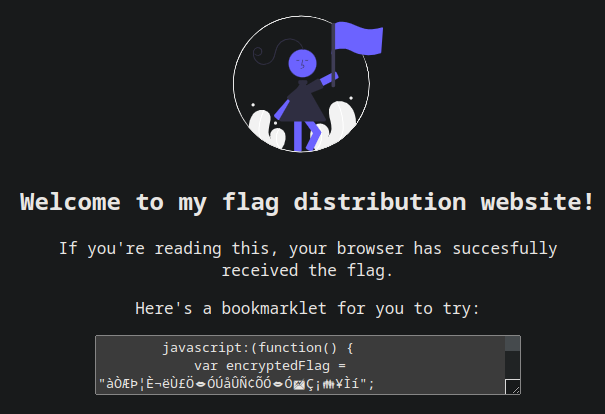
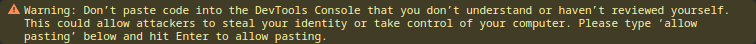

# Description
Why search for the flag when I can make a bookmarklet to print it for me?
Browse here, and find the flag!

# Provided
\-

# Progress
I get greeted by this:




So a JavaScript function... I will just use the console, I guess:



RIGHT...

```
allow pasting
```
and repeat:
```
picoCTF{p@g3_turn3r_0c0d211f}
```

# Bookmarklet
Considering the name of the challenge I think I was considered to create a bookmark with that, but that seems way to complicated for how easy it is to solve.
