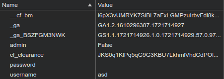

# Description
The factory is hiding things from all of its users. Can you login as Joe and find what they've been looking at? https://jupiter.challenges.picoctf.org/problem/13594/ (link) or http://jupiter.challenges.picoctf.org:13594

# Provided
\-

# Progress


I'm supposed to log in as Joe, hmm? Let's try that with a random password.


What about other users? Works as well... Same ending with the same message. Time for some inspection:

There is nothing in the html. Neither does it help to go to the root folders. The login seems to be handled on the server side. Maybe Cookies?

Before login:


After login:



Admin False? Is Joe admin?


I'm sorry what now? Seems like i made a capitalization mistake earlier...

Anyway back to the cookies: login as anyone and set admin to true:


```
picoCTF{th3_c0nsp1r4cy_l1v3s_d1c24fef}
```