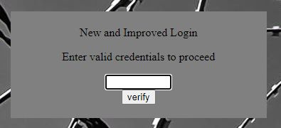
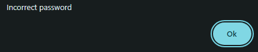

# Description
Can you break into this super secure portal? https://jupiter.challenges.picoctf.org/problem/56816/ (link) or http://jupiter.challenges.picoctf.org:56816

# Provided
\-

# Progress

Random string:


Time for web inspection:
``` html
<html>
  <head>
    <title>Secure Login Portal V2.0</title>
  </head>
  <body background="barbed_wire.jpeg" >
    <!-- standard MD5 implementation -->
    <script type="text/javascript" src="md5.js"></script>
    
    <script type="text/javascript">
      var _0x5a46=['37115}','_again_3','this','Password\x20Verified','Incorrect\x20password','getElementById','value','substring','picoCTF{','not_this'];(function(_0x4bd822,_0x2bd6f7){var _0xb4bdb3=function(_0x1d68f6){while(--_0x1d68f6){_0x4bd822['push'](_0x4bd822['shift']());}};_0xb4bdb3(++_0x2bd6f7);}(_0x5a46,0x1b3));var _0x4b5b=function(_0x2d8f05,_0x4b81bb){_0x2d8f05=_0x2d8f05-0x0;var _0x4d74cb=_0x5a46[_0x2d8f05];return _0x4d74cb;};function verify(){checkpass=document[_0x4b5b('0x0')]('pass')[_0x4b5b('0x1')];split=0x4;if(checkpass[_0x4b5b('0x2')](0x0,split*0x2)==_0x4b5b('0x3')){if(checkpass[_0x4b5b('0x2')](0x7,0x9)=='{n'){if(checkpass[_0x4b5b('0x2')](split*0x2,split*0x2*0x2)==_0x4b5b('0x4')){if(checkpass[_0x4b5b('0x2')](0x3,0x6)=='oCT'){if(checkpass[_0x4b5b('0x2')](split*0x3*0x2,split*0x4*0x2)==_0x4b5b('0x5')){if(checkpass['substring'](0x6,0xb)=='F{not'){if(checkpass[_0x4b5b('0x2')](split*0x2*0x2,split*0x3*0x2)==_0x4b5b('0x6')){if(checkpass[_0x4b5b('0x2')](0xc,0x10)==_0x4b5b('0x7')){alert(_0x4b5b('0x8'));}}}}}}}}else{alert(_0x4b5b('0x9'));}}
    </script>
    <div style="position:relative; padding:5px;top:50px; left:38%; width:350px; height:140px; background-color:gray">
      <div style="text-align:center">
        <p>New and Improved Login</p>
        
        <p>Enter valid credentials to proceed</p>
        <form action="index.html" method="post">
          <input type="password" id="pass" size="8" />
          <br/>
          <input type="submit" value="verify" onclick="verify(); return false;" />
        </form>
      </div>
    </div>
  </body>
</html>
```
So the button first:
~~~ html
<input type="submit" value="verify" onclick="verify(); return false;" />
~~~
So a verify function hmm? Searching for verify: oh god this line:
~~~ javascript
var _0x5a46=['37115}','_again_3','this','Password\x20Verified','Incorrect\x20password','getElementById','value','substring','picoCTF{','not_this'];(function(_0x4bd822,_0x2bd6f7){var _0xb4bdb3=function(_0x1d68f6){while(--_0x1d68f6){_0x4bd822['push'](_0x4bd822['shift']());}};_0xb4bdb3(++_0x2bd6f7);}(_0x5a46,0x1b3));var _0x4b5b=function(_0x2d8f05,_0x4b81bb){_0x2d8f05=_0x2d8f05-0x0;var _0x4d74cb=_0x5a46[_0x2d8f05];return _0x4d74cb;};function verify(){checkpass=document[_0x4b5b('0x0')]('pass')[_0x4b5b('0x1')];split=0x4;if(checkpass[_0x4b5b('0x2')](0x0,split*0x2)==_0x4b5b('0x3')){if(checkpass[_0x4b5b('0x2')](0x7,0x9)=='{n'){if(checkpass[_0x4b5b('0x2')](split*0x2,split*0x2*0x2)==_0x4b5b('0x4')){if(checkpass[_0x4b5b('0x2')](0x3,0x6)=='oCT'){if(checkpass[_0x4b5b('0x2')](split*0x3*0x2,split*0x4*0x2)==_0x4b5b('0x5')){if(checkpass['substring'](0x6,0xb)=='F{not'){if(checkpass[_0x4b5b('0x2')](split*0x2*0x2,split*0x3*0x2)==_0x4b5b('0x6')){if(checkpass[_0x4b5b('0x2')](0xc,0x10)==_0x4b5b('0x7')){alert(_0x4b5b('0x8'));}}}}}}}}else{alert(_0x4b5b('0x9'));}}
~~~
Guess i should do some code styling first:
~~~ javascript
var _0x5a46=['37115}','_again_3','this','Password\x20Verified','Incorrect\x20password','getElementById','value','substring','picoCTF{','not_this'];
(
  function(_0x4bd822,_0x2bd6f7){
    var _0xb4bdb3=function(_0x1d68f6){
      while(--_0x1d68f6){
        _0x4bd822['push'](_0x4bd822['shift']());
      }
    };
    _0xb4bdb3(++_0x2bd6f7);
  }
  (_0x5a46,0x1b3)
);
var _0x4b5b=function(_0x2d8f05,_0x4b81bb){
  _0x2d8f05=_0x2d8f05-0x0;
  var _0x4d74cb=_0x5a46[_0x2d8f05];
  return _0x4d74cb;
};
function verify(){
  checkpass=document[_0x4b5b('0x0')]('pass')[_0x4b5b('0x1')];
  split=0x4;
  if(checkpass[_0x4b5b('0x2')](0x0,split*0x2)==_0x4b5b('0x3')){
    if(checkpass[_0x4b5b('0x2')](0x7,0x9)=='{n'){
      if(checkpass[_0x4b5b('0x2')](split*0x2,split*0x2*0x2)==_0x4b5b('0x4')){
        if(checkpass[_0x4b5b('0x2')](0x3,0x6)=='oCT'){
          if(checkpass[_0x4b5b('0x2')](split*0x3*0x2,split*0x4*0x2)==_0x4b5b('0x5')){
            if(checkpass['substring'](0x6,0xb)=='F{not'){
              if(checkpass[_0x4b5b('0x2')](split*0x2*0x2,split*0x3*0x2)==_0x4b5b('0x6')){
                if(checkpass[_0x4b5b('0x2')](0xc,0x10)==_0x4b5b('0x7')){
                  alert(_0x4b5b('0x8'));
                }
              }
            }
          }
        }
      }
    }
  }
  else{
    alert(_0x4b5b('0x9'));
  }
}
~~~
great an obfuscated script.... *sigh* Guess i start with deobfuscation before doing anything:<br>
should have used https://deobfuscate.io/ right from the get go...

You know what nevermind. i have a console and i will use it: first i will take the huge if block and transform it:

- replace ' ' with ''
- replace 'if(' with 'console.log('
- replace '==' with ')\nconsole.log('
- replace '){' with ');'

results in:
~~~ javascript
console.log(checkpass[_0x4b5b('0x2')](0x0,split*0x2))
console.log(_0x4b5b('0x3'));
console.log(checkpass[_0x4b5b('0x2')](0x7,0x9))
console.log('{n');
console.log(checkpass[_0x4b5b('0x2')](split*0x2,split*0x2*0x2))
console.log(_0x4b5b('0x4'));
console.log(checkpass[_0x4b5b('0x2')](0x3,0x6))
console.log('oCT');
console.log(checkpass[_0x4b5b('0x2')](split*0x3*0x2,split*0x4*0x2))
console.log(_0x4b5b('0x5'));
console.log(checkpass['substring'](0x6,0xb))
console.log('F{not');
console.log(checkpass[_0x4b5b('0x2')](split*0x2*0x2,split*0x3*0x2))
console.log(_0x4b5b('0x6'));
console.log(checkpass[_0x4b5b('0x2')](0xc,0x10))
console.log(_0x4b5b('0x7'));
~~~
result:
~~~
VM1406:1 a
VM1406:2 picoCTF{
VM1406:3 
VM1406:4 {n
VM1406:5 
VM1406:6 not_this
VM1406:7 
VM1406:8 oCT
VM1406:9 
VM1406:10 37115}
VM1406:11 
VM1406:12 F{not
VM1406:13 
VM1406:14 _again_3
VM1406:15 
VM1406:16 this
~~~

HAH so checkpass grants the input string and compares it to whatever is on the right. But it's not in order... so the checkpass get's scrambeled... I could analyse `_0x4b5b` or i just pray that the tupple is the range of the input string:
|range|value|
|--|--|
|0-8| picoCTF{|
|7-9| {n|
|8-16| not_this|
|3-6| oCT|
|24-32| 37115}|
|6-11| F{not|
|16-20|_again_3|
|12-16|this|

now ordering:
~~~
picoCTF{
       {n
        not_this
   oCT      |                
            |          37115}
      F{not |          |      
            |   _again_3
            this
~~~
~~~
picoCTF{not_this_again_37115}
~~~
*The Website itself doesn't confirm it but at least it doesn't tell me it's wrong anymore*