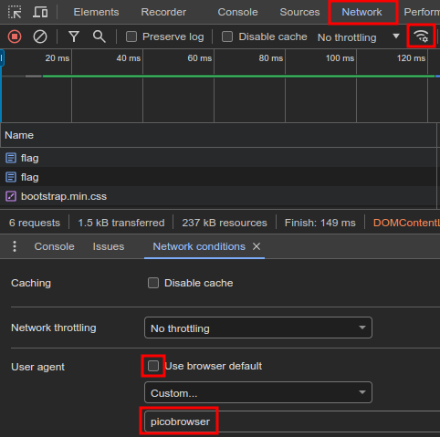
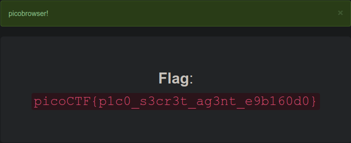

# Description
This website can be rendered only by picobrowser, go and catch the flag! https://jupiter.challenges.picoctf.org/problem/26704/ (link) or http://jupiter.challenges.picoctf.org:26704

# Provided
\-

# Progress
So using the picobrowser. So Browser Spoofing?

Where was that Option in Chrome again...



Klick on flag:



```
picoCTF{p1c0_s3cr3t_ag3nt_e9b160d0}
```

How about using the console:
```bash
curl -A "picobrowser" https://jupiter.challenges.picoctf.org/problem/26704/flag
```

provides the flag as well.